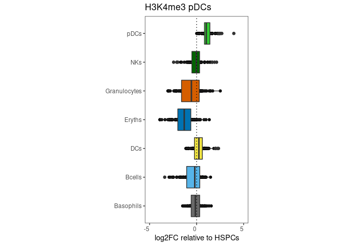

    # Jake Yeung
    # Date of Creation: 2022-09-12
    # File: ~/projects/sortchicAnalysis/vignettes/Supplemental_Figures/Sup_Fig_2_DE_analysis_relative_to_HSPCs.R
    # Example of analysis of differentially expressed genes relative to HSPCs
    # from /home/hub_oudenaarden/jyeung/projects/scChiC/scripts/rstudioserver_analysis/spikeins/primetime_plots/3d-DE_downstream.TSS.label_genes.R

    rm(list=ls())

    library(dplyr)
    library(tidyr)
    library(ggplot2)
    library(data.table)
    library(Matrix)
    library(scchicFuncs)
    library(ggrepel)
    library(JFuncs)
    library(usethis)

    library(sortchicAnalysis)

    save.plots <- FALSE

    # PDFs --------------------------------------------------------------------

    mark1 <- "H3K4me1"; mark2vec <- c("H3K4me3", "H3K27me3")

    if (save.plots){
      pdfout <- file.path("outputs", paste0("DE_TSS_genesets.refmark_", mark1, ".labels.noordering.", Sys.Date(), ".pdf"))
    }

    # Load metadata -----------------------------------------------------------

    jmarks3 <- c(mark1, mark2vec); names(jmarks3) <- jmarks3

    data("dat_metas")
    dat.metas <- dat_metas
    cluster2col <- hash::hash(dat.metas[[1]]$cluster, dat.metas[[1]]$clustercol)

    dat.meta.colors <- subset(dat.metas$H3K4me1, select = c(cluster, clustercol))

    # Show data  --------------------------------------------------------------

    jmarks <- c("H3K4me1", "H3K4me3", "H3K27me3", "H3K9me3"); names(jmarks) <- jmarks
    m.lst <- lapply(jmarks, function(jmark){
      jdat <- dat.metas[[jmark]]
      ggplot(jdat, aes(x = umap1, y = umap2, color = clustercol)) +
        geom_point() +
        ggtitle(jmark) +
        theme_bw() +
        scale_color_identity( labels = dat.meta.colors$cluster, breaks = dat.meta.colors$clustercol, guide = "legend") +
        theme(aspect.ratio=1, panel.grid.major = element_blank(), panel.grid.minor = element_blank())
    })
    print(m.lst)

    ## $H3K4me1

    ## 
    ## $H3K4me3

    ## 
    ## $H3K27me3

    ## 
    ## $H3K9me3

    # Load gene annots --------------------------------------------------------

    # dat.genes <- GetGeneSets(inf.genes.k4me1 = "inst/extdata/geneset_H3K4me1_TSS_topics2.filt.colorcoded2.txt",
    #                           inf.genes.k4me3 = "inst/extdata/celltype_specific_genes_defined_by_K4me3_TSS.txt")

    data("dat_genes")
    dat.genes <- dat_genes

    # try Eryth-specific genes
    jsets.vec <- as.character(unique(dat.genes$jset))
    names(jsets.vec) <- jsets.vec

    ctypespec.lst <- lapply(jsets.vec, function(jjset){
      subset(dat.genes, jset == jjset)$gene
    })

    ctypespec.hash <- hash::hash(ctypespec.lst)

    stypecols <- c("grey", "blue", "red")

    # Load data ---------------------------------------------------------------

    data("fits_all")  # fits_all

    jmarks <- c("H3K4me1", "H3K4me3", "H3K27me3", "H3K9me3"); names(jmarks) <- jmarks

    dat.params.lst <- lapply(jmarks, function(jmark){
      print(jmark)
      # inf.rdata <- file.path(hubprefix, paste0("jyeung/data/scChiC/from_rstudioserver/poisson_fits_BM_AllMerged3.again/poisson_fit_TSS.", jmark, ".2020-12-12.newannot2.witherrors.TSS.RData"))
      # load(inf.rdata, v=T)
      # jfits.lst1 <- jfits.lst
      jfits.lst1 <- fits_all[[jmark]]

      params.lst1 <- lapply(jfits.lst1, function(x){
        xkeep <- grepl("^Cluster.*.Estimate$", x = names(x))
        x[xkeep]
      })

      # pvals.vec <- unlist(lapply(jfits.lst1, function(x) x$pval))
      pvals.dat <- data.frame(bin = names(jfits.lst1), pval = unlist(lapply(jfits.lst1, function(x) x$pval)), stringsAsFactors = FALSE)

      jnames <- names(jfits.lst1)
      names(jnames) <- jnames

      params.dat1 <- lapply(jnames, function(jname){
        jparams <- params.lst1[[jname]]
        if (is.null(jparams)){
          return(data.frame(NULL))
        }
        # assertthat::assert_that(!is.null(jparams))
        data.frame(bin = jname, param = names(jparams), estimate = unlist(jparams), mark = jmark, stringsAsFactors = FALSE)
      }) %>%
        bind_rows() %>%
        left_join(., pvals.dat)
      if (jmark == "H3K9me3"){
        params.dat1 <- params.dat1 %>%
          mutate(param = gsub("Eryth", "Eryths", param),
                 param = gsub("Lymphoid", "Bcells", param))
      }
      return(params.dat1)
    })

    ## [1] "H3K4me1"

    ## Joining, by = "bin"

    ## [1] "H3K4me3"

    ## Joining, by = "bin"

    ## [1] "H3K27me3"

    ## Joining, by = "bin"

    ## [1] "H3K9me3"

    ## Joining, by = "bin"

    # handle k27me3 rownames --------------------------------------------------

    bins.all <- unique(dat.params.lst[["H3K4me1"]]$bin)
    coords <- sapply(bins.all, function(b) paste("chr", strsplit(b, ";")[[1]][[1]], sep = ""))
    coord2rname <- hash::hash(coords, bins.all)

    dat.params.lst[["H3K27me3"]]$bin <- sapply(dat.params.lst[["H3K27me3"]]$bin, function(b) AssignHash(x = b, jhash = coord2rname, null.fill = b))

    # Set mark  ---------------------------------------------------------------

    if (save.plots){
      pdf(pdfout, useDingbats = FALSE)
    }

    jmark <- mark1

    # ggplot(dat.params.lst[[jmark]] %>% filter(abs(estimate) < 5), aes(x = estimate, fill = param)) +
    #        ggtitle(jmark) +
    #        geom_density() +
    #        facet_wrap(~param) +
    #        theme_bw() +
    #        geom_vline(xintercept = 0, linetype = "dotted") +
    #        theme(aspect.ratio=1, panel.grid.major = element_blank(), panel.grid.minor = element_blank())

    dat.params.wide.lst <- lapply(dat.params.lst, function(jdat){
      reshape2::dcast(data = jdat, formula = bin ~ param + mark, value.var = "estimate")
    })

    dat.params.wide.joined <- Reduce(f = full_join, x = dat.params.wide.lst)

    ## Joining, by = "bin"
    ## Joining, by = "bin"
    ## Joining, by = "bin"

    # fill NAs with zeros
    # dat.params.wide.joined[is.na(dat.params.wide.joined)] <- 0
    #
    # ggplot(dat.params.wide.joined, aes(x = ClusterEryths.Estimate_H3K27me3, y = ClusterEryths.Estimate_H3K9me3)) +
    #   geom_point(alpha = 0.25) +
    #   theme_bw() +
    #   geom_density_2d() +
    #   geom_vline(xintercept = 0, linetype = "dotted") +
    #   geom_hline(yintercept = 0, linetype = "dotted") +
    #   coord_cartesian(xlim = c(-5, 5), ylim = c(-5, 5)) +
    #   theme(aspect.ratio=1, panel.grid.major = element_blank(), panel.grid.minor = element_blank())
    #
    # ggplot(dat.params.wide.joined, aes(x = ClusterBcells.Estimate_H3K4me1, y = ClusterBcells.Estimate_H3K27me3)) +
    #   geom_point(alpha = 0.25) +
    #   theme_bw() +
    #   geom_density_2d() +
    #   geom_vline(xintercept = 0, linetype = "dotted") +
    #   geom_hline(yintercept = 0, linetype = "dotted") +
    #   coord_cartesian(xlim = c(-5, 5), ylim = c(-5, 5)) +
    #   theme(aspect.ratio=1, panel.grid.major = element_blank(), panel.grid.minor = element_blank())

    # show priming?

    # jjset <- "Bcells"
    jjsets <- unique(as.character(dat.genes$jset))

    q25 <- function(x, p = 0.25){
      quantile(x, probs  = p)
    }

    for (jmarktmp in jmarks3){
      print(jmarktmp)
      for (jjset in jjsets){
        print(jjset)
        jbins.tmp <- subset(dat.genes, jset == jjset)$gene
        jtmp <- dat.params.lst[[jmarktmp]] %>% filter(bin %in% jbins.tmp)
        print(dim(jtmp))
        jtmp$param <- gsub("Cluster", "", jtmp$param)
        jtmp$param <- gsub(".Estimate", "", jtmp$param)
        jtmp$jcol <- sapply(jtmp$param, function(x) cluster2col[[x]])
        jtmp$gene <- sapply(jtmp$bin, function(b) strsplit(b, "\\.")[[1]][[4]])
        nbins <- length(unique(jtmp$bin))
        ngenes <-length(unique(jtmp$gene))

        # no ordering
        m <- ggplot(jtmp,
                    aes(x = param,
                        y = estimate / log(2),
                        fill = jcol)) +
          geom_point() +
          scale_fill_identity() +
          ggtitle(jjset) +
          geom_boxplot() +
          theme_bw() +
          xlab("") +
          ylab("log2FC relative to HSPCs") +
          ggtitle(paste(jmarktmp, jjset)) +
          theme(aspect.ratio=2, panel.grid.major = element_blank(), panel.grid.minor = element_blank(), axis.text.x = element_text(angle = 0, hjust = 1, vjust = 1)) +
          coord_flip(ylim = c(-5, 5)) +
          scale_y_continuous(breaks = c(-5, 0, 5)) +
          geom_hline(yintercept = 0, linetype = "dotted")
        print(m)

        # ordering
        # m <- ggplot(jtmp, aes(x = forcats::fct_reorder(.f = param, .x = estimate, .fun = q25, .desc = TRUE), y = estimate / log(2), fill = jcol)) +
        #   geom_point() +
        #   scale_fill_identity() +
        #   coord_cartesian(ylim = c(-5, 5)) +
        #   ggtitle(jjset) +
        #   geom_boxplot() +
        #   geom_hline(yintercept = 0, linetype = "dotted") +
        #   theme_bw() +
        #   xlab("") +
        #   ylab("log2FC relative to HSPCs") +
        #   ggtitle(paste(jmarktmp, jjset, nbins)) +
        #   theme(aspect.ratio=2, panel.grid.major = element_blank(), panel.grid.minor = element_blank(), axis.text.x = element_text(angle = 45, hjust = 1, vjust = 1))
        # print(m)
      }
    }

    ## [1] "H3K4me1"
    ## [1] "Eryths"
    ## [1] 1057    5

    ## [1] "Bcells"
    ## [1] 1141    5

    ## [1] "NKs"
    ## [1] 1099    5

    ## [1] "Granulocytes"
    ## [1] 1071    5

    ## [1] "Basophils"
    ## [1] 175   5

    ## [1] "pDCs"
    ## [1] 637   5

    ## [1] "DCs"
    ## [1] 1134    5

    ## [1] "HSPCs"
    ## [1] 1085    5

    ## [1] "H3K4me3"
    ## [1] "Eryths"
    ## [1] 1057    5

    ## [1] "Bcells"
    ## [1] 1141    5

    ## [1] "NKs"
    ## [1] 1099    5

    ## [1] "Granulocytes"
    ## [1] 1071    5

    ## [1] "Basophils"
    ## [1] 175   5

    ## [1] "pDCs"
    ## [1] 637   5

    ## [1] "DCs"
    ## [1] 1134    5

    ## [1] "HSPCs"
    ## [1] 1085    5

    ## [1] "H3K27me3"
    ## [1] "Eryths"
    ## [1] 1057    5

    ## [1] "Bcells"
    ## [1] 1141    5

    ## [1] "NKs"
    ## [1] 1099    5

    ## [1] "Granulocytes"
    ## [1] 1071    5

    ## [1] "Basophils"
    ## [1] 175   5

    ## [1] "pDCs"
    ## [1] 637   5

    ## [1] "DCs"
    ## [1] 1134    5

    ## [1] "HSPCs"
    ## [1] 1085    5

    if (save.plots){
      dev.off()
    }
