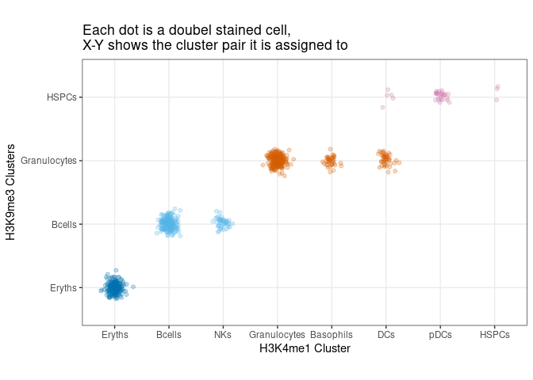
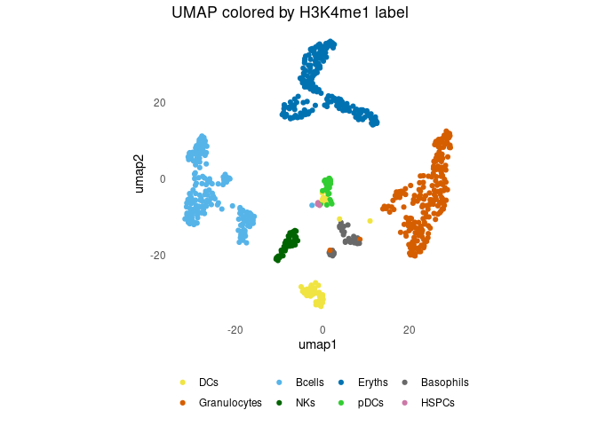
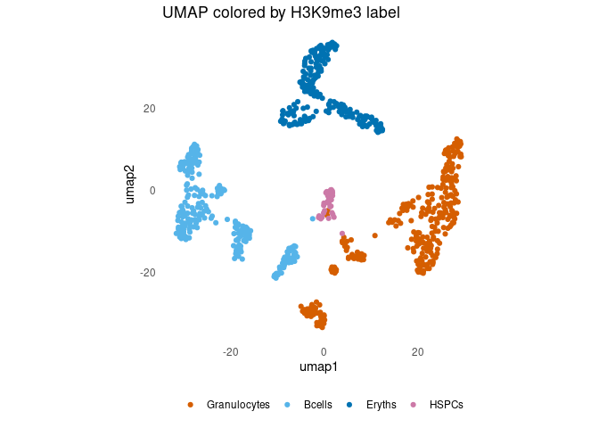
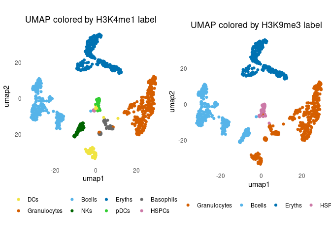

show_dual_labeling_outputs.R
================
jyeung
2022-10-22

``` r
# Jake Yeung
# Date of Creation: 2022-10-22
# File: ~/projects/sortchicAnalysis/vignettes/show_dual_labeling_outputs.R
#

rm(list=ls())

library(dplyr)
library(tidyr)
library(ggplot2)
library(data.table)
library(Matrix)
library(ggforce)
library(JFuncs) # https://github.com/jakeyeung/JFuncs

# Load inference outputs --------------------------------------------------

data("coords_dbl_assignment_cleaned") # dat.umap.long.annot.genomewide.clean


# Each cell is assigned to a K4me1 label and a K9me3 label ----------------

head(dat.umap.long.annot.genomewide.clean)
```

    ##                               cell lnprob         w louv.repress.impute louv.act.impute clustercol.act clustercol.repress      umap1      umap2 louvain
    ## 1  PZ-BM-rep3-H3K9me3-H3K4me1-1_60      0 0.4765582        Granulocytes             DCs        #F0E442            #D55E00  -4.649742 -29.440868       1
    ## 2 PZ-BM-rep3-H3K9me3-H3K4me1-1_290      0 0.4927144        Granulocytes    Granulocytes        #D55E00            #D55E00  22.054004 -18.076987       2
    ## 3 PZ-BM-rep3-H3K9me3-H3K4me1-1_133      0 0.5377332              Bcells          Bcells        #56B4E9            #56B4E9 -18.509496 -12.225809       3
    ## 4 PZ-BM-rep3-H3K9me3-H3K4me1-1_306      0 0.3738243              Bcells          Bcells        #56B4E9            #56B4E9 -30.938533 -11.387080       4
    ## 5  PZ-BM-rep3-H3K9me3-H3K4me1-1_46      0 0.5162263              Bcells             NKs        #006400            #56B4E9  -8.940224 -17.770335       5
    ## 6  PZ-BM-rep3-H3K9me3-H3K4me1-1_61      0 0.5953464              Bcells          Bcells        #56B4E9            #56B4E9 -24.810489  -5.232969       4

``` r
jmarks <- c("H3K4me1", "H3K9me3"); names(jmarks) <- jmarks
cbPalette <- c("#696969", "#56B4E9", "#F0E442", "#0072B2", "#D55E00", "#CC79A7", "#006400",  "#32CD32", "#FFB6C1", "#0b1b7f", "#ff9f7d", "#eb9d01", "#2c2349", "#753187", "#f80597")

m.grid <- ggplot(dat.umap.long.annot.genomewide.clean, aes(x = louv.act.impute, y = louv.repress.impute, color = clustercol.repress)) +
  geom_point(alpha = 0.25, position = position_jitternormal(sd_x = 0.08, sd_y = 0.08)) +
  theme_bw() +
  theme(aspect.ratio=0.6) +
  scale_color_identity() + xlab(paste0(jmarks[[1]], " Cluster")) + ylab(paste0(jmarks[[2]], " Clusters")) +
  ggtitle("Each dot is a doubel stained cell,\nX-Y shows the cluster pair it is assigned to")
print(m.grid)
```

<!-- -->

``` r
# One can visualize the dual labels by showing the H3K4me1+H3K36me --------

m.umap.act <- ggplot(dat.umap.long.annot.genomewide.clean, aes(x = umap1, y = umap2, color = clustercol.act)) +
  geom_point() +
  theme_minimal() +
  scale_color_identity( labels = dat.umap.long.annot.genomewide.clean$louv.act.impute, breaks = dat.umap.long.annot.genomewide.clean$clustercol.act,
                        guide = "legend") +
  ggtitle("UMAP colored by H3K4me1 label") +
  theme(aspect.ratio=1, panel.grid.major = element_blank(), panel.grid.minor = element_blank(), legend.position = "bottom", legend.title = element_blank())

m.umap.repress <- ggplot(dat.umap.long.annot.genomewide.clean, aes(x = umap1, y = umap2, color = clustercol.repress)) +
  geom_point() +
  theme_minimal() +
  scale_color_identity( labels = dat.umap.long.annot.genomewide.clean$louv.repress.impute, breaks = dat.umap.long.annot.genomewide.clean$clustercol.repres,
                        guide = "legend") +
  ggtitle("UMAP colored by H3K9me3 label") +
  theme(aspect.ratio=1, panel.grid.major = element_blank(), panel.grid.minor = element_blank(), legend.position = "bottom", legend.title = element_blank())

print(m.umap.act)
```

<!-- -->

``` r
print(m.umap.repress)
```

<!-- -->

``` r
JFuncs::multiplot(m.umap.act, m.umap.repress, cols = 2)
```

<!-- -->
